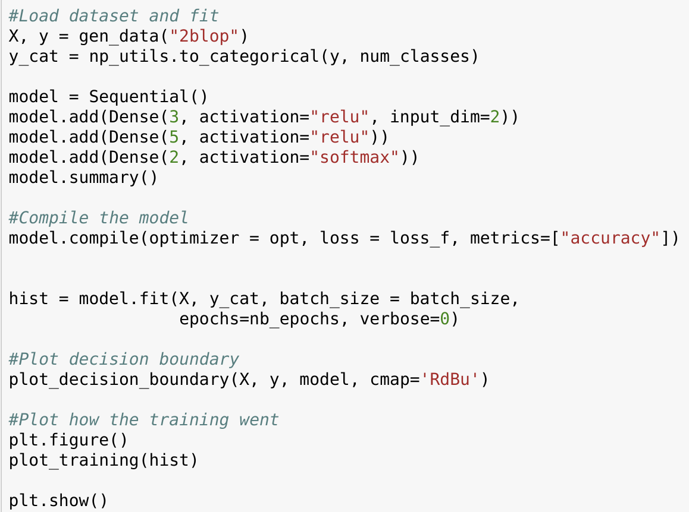

# Neural Networks - Advanced Image Analysis

Jacob Jon Hansen (s134097)
Phillip Brinck Vetter (s144097)

## Exercise 1

Using python and sklearn we construct our 3 training sets (using our own written functions:

```python
#Load data and plot the three cases
plt.figure()
X, y = gen_data("2blop")
plot_data(X,y)

plt.figure()
X, y = gen_data("blop_circle")
plot_data(X,y)

plt.figure()
X, y = gen_data("4blop")
plot_data(X,y)

plt.show()
```


The following code are our high level hyper parameters for all the three networks: 

```python
#Parameters for NN
num_classes = 2
opt = "adam"
loss_f = 'categorical_crossentropy'
batch_size = 64
nb_epochs = 100	
```

Training is run with following code:



### 2 blops


### Blop and circle


### 4 blops


## Exercise 2: MNIST

For this we used Keras since we have extensive knowledge of DL and therefore it seemed redundant to sit and program everything from scratch. This is thus not a "valid" competition attempt, but it shows the power of leveraging a good framework to achieve an accuracy of **99.4%** 

In order to have a network which generalizes better we use a datagenerator which takes the images from the training set and arguments them with random rotations, zoom and translations:

```python
datagen = ImageDataGenerator(rotation_range = 20, 
                             width_shift_range = 0.1,
                             height_shift_range = 0.1,
                             zoom_range=0.2)
datagen.fit(X_train)
```


The following model is defined: 


It uses and CNN, with tricks such as batch normalization (improves training speed) and dropout to increase the ability to generate to new data.

The network is trained with the following parameters:

```python
#Parameters
num_classes = 10
opt = "adam"
loss_f = 'categorical_crossentropy'
batch_size = 64
nb_epochs = 15
```

Training is performed on a big server with a 8 GB GPU, each epoch took 12 seconds (400 on my laptop running a gtx 1050). During training the best model (highest acc on test set) is saved so ensure that we will have the optimal model even if it starts to overfit the training set. This can be done with the following code:

```python
#Save best model under training
from keras.callbacks import ModelCheckpoint
filepath="weights_CNN.best.hdf5"
checkpoint = ModelCheckpoint(filepath, monitor='val_acc', 
                             verbose=1, save_best_only=True, mode='max')
callbacks_list = [checkpoint]


#Fit the model
model.fit_generator(train_generator, 
                    steps_per_epoch = len(X_train) / (2*batch_size),
                    epochs = nb_epochs,
                    validation_data = test_generator,
                    validation_steps = len(y_test)/ batch_size,
                    callbacks = callbacks_list)
```

After training we load the best weights and test:


## Exercise 3: Using VGG19 on breast cancer images.

VGG19 is a powerful architecture that can be downloaded with pretrained weights. The layers in the network are training on the ImageNet challenge, so they will produce a lot of image features. The early layers will give simple features such as lines, circles etc. The last layers will give more abstract features such as eyes, fur, ears etc used for the imagenet dataset. We have used the first fully connected layer at the end and used this to generate features for the images in the breast cancer dataset. A KNN is fitted to these features and we see a performance of **88%** with 11 neighbours. Another method would be to do retraining. This can be done by freezing all the CNN layers and defining our own output layer and training this with our data to do transfer learning. 


**Dataset**:


**Model:**

Code to load the model (note that we say include_top=True, this ensure that the model is also using the last FCC layers. We can define a new model from this base model, specifying which layer should be our output.

```python
from keras import applications
from keras.models import Sequential, Model 

img_width, img_height = (X.shape[0], X.shape[1])

#Define model
model = applications.VGG19(weights = "imagenet", include_top=True, 
                           input_shape = (img_width, img_height, 3))
model = Model(inputs=model.input, outputs=model.get_layer('fc1').output)
```


The model has the following architecture, notice that we have 122M parameters so it would take forever to train ourselves:


Now we just predict the features, combine these into a big array and feed them into a KNN.

```python
n = X.shape[3]
features_all = np.zeros((n, features.flatten().shape[0]))

#Generate features
for i in range(n):
    x = image.img_to_array(X[:,:,:,i])
    x = np.expand_dims(x, axis=0)
    x = preprocess_input(x)

    features = model.predict(x)
    features_all[i,:] = features.flatten()
    
from sklearn import neighbors, datasets
from sklearn.metrics import accuracy_score

from sklearn.preprocessing import normalize
normed = normalize(features_all)

knn = neighbors.KNeighborsClassifier(n_neighbors = 11)

knn.fit(normed, y.ravel()-1)

pred = knn.predict(features_all)
print(accuracy_score(y.ravel()-1, pred)) #-> 0.880
```

